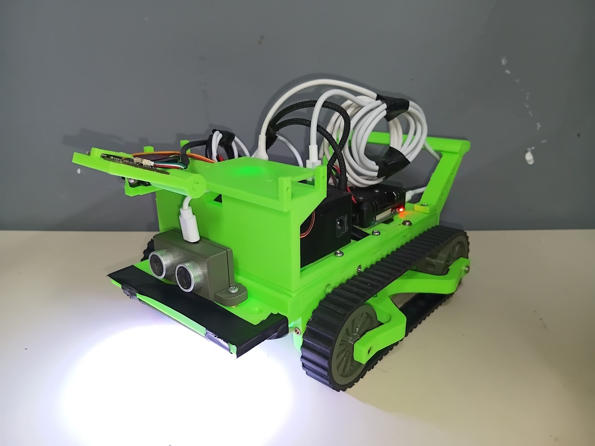
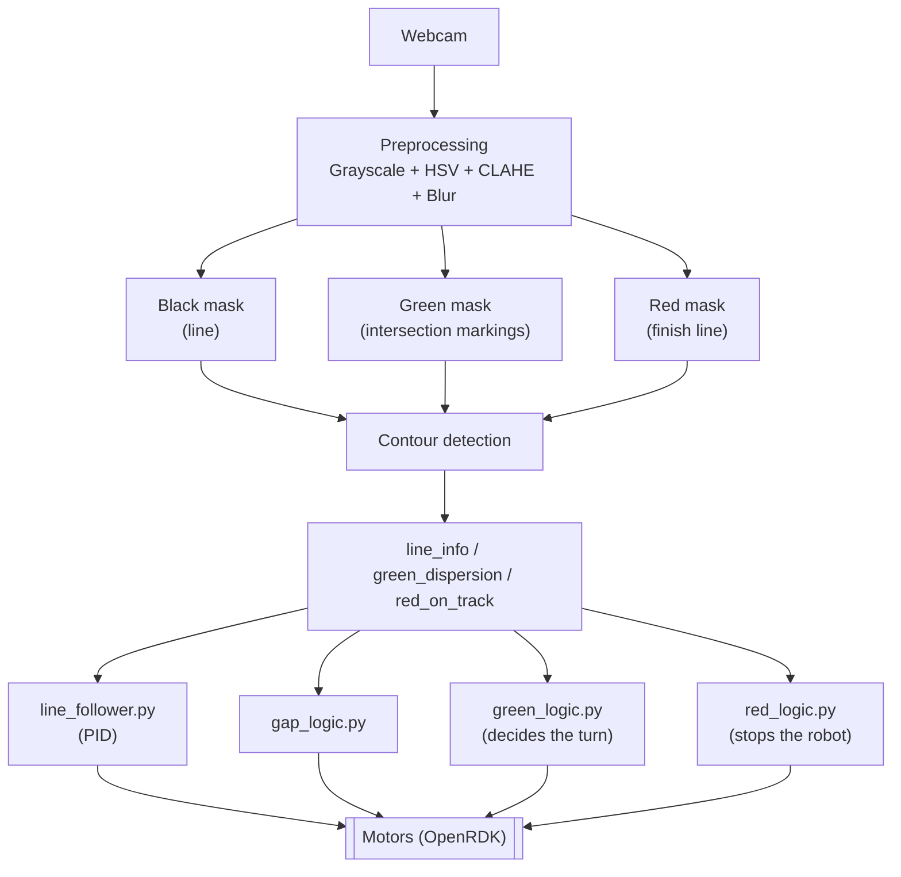

<div align="center">

# 🤖 RoboVante — Line Follower Robot (OBR)

**Autonomous line-following robot developed by team RoboVante for the Brazilian Robotics Olympiad (OBR), representing the state of Bahia.**


</div>

---

## 📑 Table of Contents

- [About the project](#-about-the-project)
- [Features](#-features)
- [Architecture](#-architecture)
- [Repository structure](#️-repository-structure)
- [Debug dashboard](#️-debug-dashboard)
- [Tech stack & hardware](#-tech-stack--hardware)
- [Getting started](#-getting-started)
- [Tests](#-tests)
- [License](#-license)
- [Team](#-team)

---

## 📖 About the project

OBR (*Olimpíada Brasileira de Robótica* — Brazilian Robotics Olympiad) is a national science competition that encourages the study of robotics and programming among Brazilian students, with both theoretical and practical stages — including the **Line Follower** category, in which this robot competes.

This repository holds the full onboard software for team **RoboVante**'s robot: a line follower that uses **computer vision** (webcam + OpenCV) to interpret the track in real time, paired with a hardware communication framework (**OpenRDK**) to drive the motors. The robot follows the track's black line, reads green markings to decide which way to go at intersections, recognizes the red finish marking, and handles gaps in the line.

## ✨ Features

- ✅ **PID line following** — continuously corrects the robot's trajectory based on the line's offset from the camera's center.
- ✅ **Intersection detection (green markings)** — analyzes the dispersion of green markings around the line to decide between going straight, turning left, turning right, or making a U-turn.
- ✅ **Finish line detection (red marking)** — recognizes the finish line and automatically stops the robot.
- ✅ **Line gap handling** — keeps the robot moving straight when the line momentarily disappears from view.
- ✅ **Browser-based debug dashboard** — live camera stream with detection overlay plus real-time telemetry.
- 🚧 **Obstacle avoidance** — maneuver logic and distance-sensor reading are already implemented but currently disabled in `main.py` (still under development/tuning).

## Preview 👀

<p align="center">
   
</p>

## 🧠 Architecture

The software is split into four independent modules: **computer vision** (interprets the track), **control** (decides the movement), **sensors** (auxiliary hardware), and **debug** (real-time browser visualization).



### Vision pipeline (`computer_vision/`)

For every frame captured from the webcam:

1. The image is converted to grayscale and HSV, with **CLAHE** applied to the V channel to compensate for uneven lighting on the track.
2. Three mutually exclusive color masks are generated (black/green/red never overlap).
3. Contours are extracted from each mask; the largest black contour defines the line, and the four largest green contours are analyzed individually.
4. Edge flags (`touches_left`, `touches_right`, `touches_top`, `touches_bottom`) indicate when the line exits the frame, allowing the green markings' position to be interpreted correctly even in sharp turns.
5. The module returns `line_info` (the line's position/offset), `green_dispersion` (which quadrant — `top_left`, `top_right`, `bottom_left`, `bottom_right` — a green marking was found in), and `red_on_track` (whether the finish line was detected).

### Control logic (`controller/`)

| Module | Responsibility |
|---|---|
| `line_follower.py` | **PID controller** (`Kp=0.2`, `Ki=0`, `Kd=0.02`) that converts the line's offset into differential motor speeds. |
| `green_logic.py` | On detecting green, the robot slows down and runs `do_second_green_check`, which confirms the marking over 10 consecutive frames before deciding the maneuver (avoids false positives). It then chooses between going straight, turning a quarter left/right, or making a U-turn. |
| `gap_logic.py` | Keeps the robot moving straight when the line isn't found (a gap in the track). |
| `red_logic.py` | Advances briefly, stops the motors, and ends execution upon recognizing the finish line. |
| `obstacle_logic.py` | Predefined maneuver sequence to drive around obstacles (not currently triggered in `main.py`). |
| `core/pid.py` / `core/basic_movements.py` | PID implementation and basic movements (straights and turns with pre-tuned durations). |

## 🗂️ Repository structure

```
OBR/
├── computer_vision/
│   ├── core/
│   │   ├── contours.py          # Contour detection and analysis
│   │   ├── green_marking.py     # Green markings' position/dispersion
│   │   ├── image_processing.py  # CLAHE and color masks (black/green/red)
│   │   ├── utils.py             # Helper functions (frame center, offset)
│   │   └── webcam.py            # Video capture (Windows/Linux)
│   └── vision.py                # Orchestrates the vision pipeline per frame
├── controller/
│   ├── core/
│   │   ├── basic_movements.py   # Basic movements (straights, turns)
│   │   └── pid.py                # PID controller
│   ├── gap_logic.py             # Handles gaps in the line
│   ├── green_logic.py           # Turn decision at intersections
│   ├── line_follower.py         # PID-based line follower
│   ├── obstacle_logic.py        # Obstacle avoidance (under development)
│   └── red_logic.py             # Stops at the finish line
├── debug/
│   ├── static/                  # Debug dashboard CSS/JS
│   ├── templates/index.html     # Debug dashboard page
│   └── debug_server.py          # Flask server (stream + telemetry)
├── sensors/
│   └── distance_sensor.py       # Distance sensor reading
├── tests/
│   ├── computer_vision_test.py  # Tests the computer vision in isolation
│   └── webview_test.py          # Tests the OpenRDK webview in isolation
├── open_rdk/                    # Submodule: hardware communication
├── main.py                      # Robot's main loop
├── requirements.txt
└── LICENSE
```

## 🖥️ Debug dashboard

The `debug/` module runs a local **Flask** server (`http://localhost:5000`) featuring:

- A live MJPEG camera stream, already drawn with the line's contour, its detected center point, and the green/red markings overlaid on the image.
- A telemetry panel refreshed every 100ms via `fetch` calls to the `/telemetry` endpoint, showing FPS, processing latency, camera resolution, the line's position/area, and the current green-marking dispersion state.

This dashboard is independent from OpenRDK's native webview (enabled in `main.py` via `enable_webview=True`), which exposes telemetry for the devices connected to the board.

## 🔧 Tech stack & hardware

- **Python 3** — the project's main language.
- **OpenCV + NumPy** — image processing and contour detection.
- **Flask** — web-based debug dashboard.
- **[OpenRDK](https://github.com/Mr-SweetRice/Open-RDK)** *(submodule)* — communication framework for the onboard board, motors, and sensors.
- **PySerial / esptool / IntelHex** — serial communication and firmware flashing for the microcontroller.
- **USB webcam** — the robot's primary vision sensor.
- Two traction motors (`left_motor`, `right_motor`) and a distance sensor (`distance_sensor_module`), identified via `openrdk.get_serial_by_name`.

## 🚀 Getting started

### Prerequisites

- Python 3.10+
- Git (with submodule support)
- USB webcam
- A robot/board compatible with OpenRDK, with the motors connected

### Installation

```bash
git clone --recurse-submodules https://github.com/OrekiHoutarouu/OBR.git
cd OBR

python -m venv venv
source venv/bin/activate      # Windows: venv\Scripts\activate

pip install -r requirements.txt
```

> The `openrdk` package is installed from the `open_rdk` submodule (see `requirements.txt`); if it isn't resolved automatically, install it manually from `open_rdk/host/main`.

### Running the robot

```bash
PYTHONPATH=open_rdk/host/main/src python3 main.py
```

On Windows (PowerShell):

```powershell
$env:PYTHONPATH="open_rdk/host/main/src"; python main.py
```

## 🧪 Tests

- **Computer vision in isolation** (no hardware/motors required, great for tuning the color masks):

  ```bash
  python tests/computer_vision_test.py
  ```

  Visit `http://localhost:5000` to view the debug dashboard.

- **OpenRDK webview in isolation** (checks communication with the devices connected to the board):

  ```bash
  python tests/webview_test.py
  ```

## 📄 License

This project is licensed under the **MIT License** — see the [LICENSE](LICENSE) file for details.

## 👥 Team

Developed by team **RoboVante**, representing Bahia at the Brazilian Robotics Olympiad (OBR).

**Author:** [@OrekiHoutarouu](https://github.com/OrekiHoutarouu)
